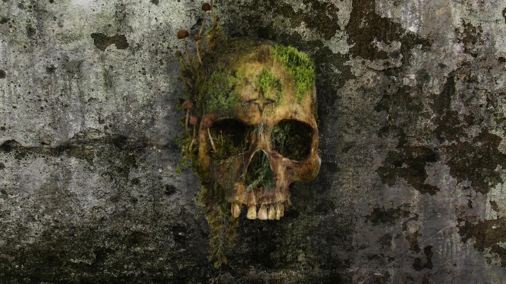
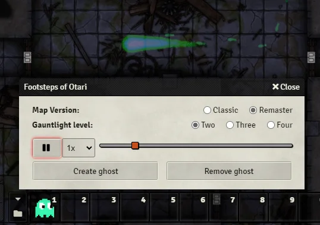
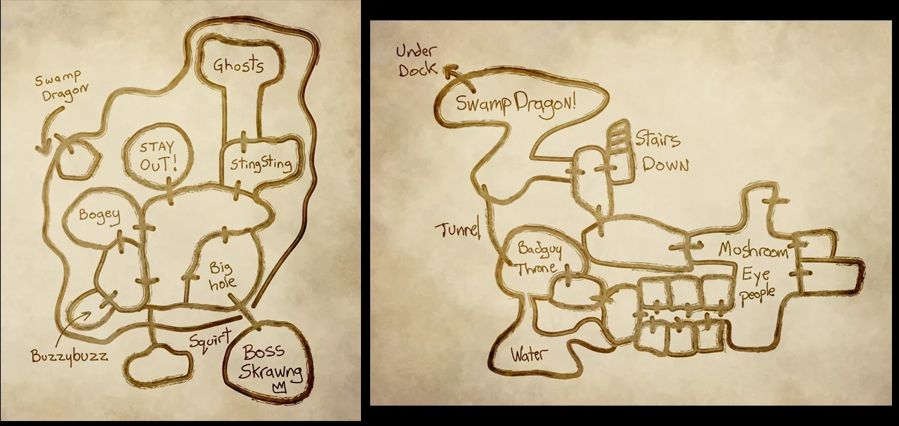
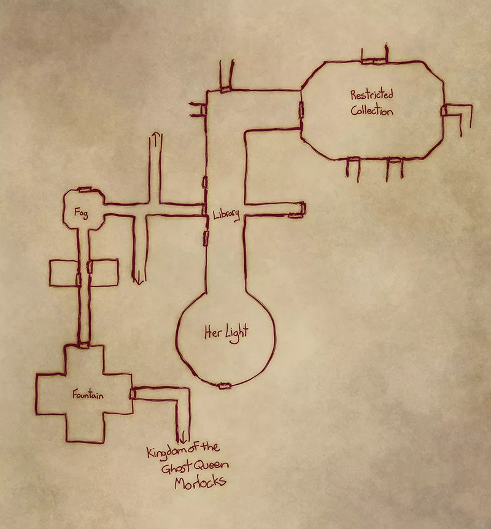
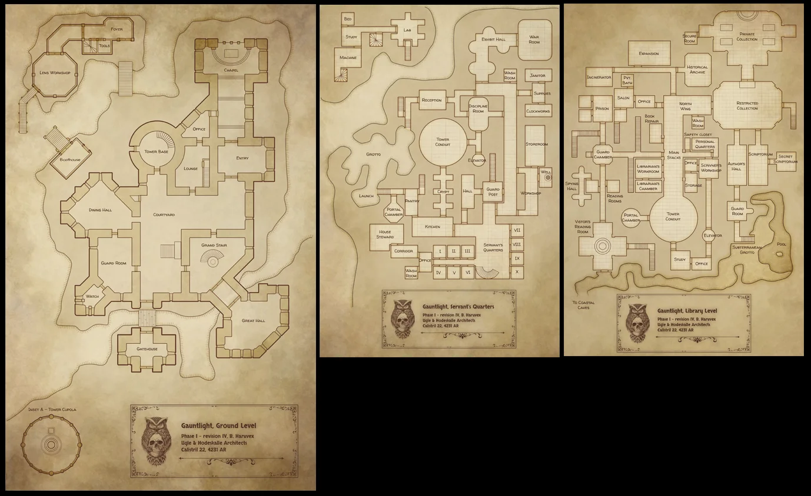
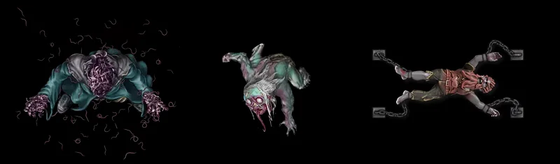
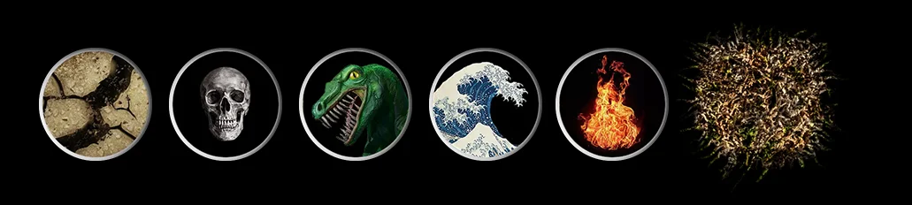
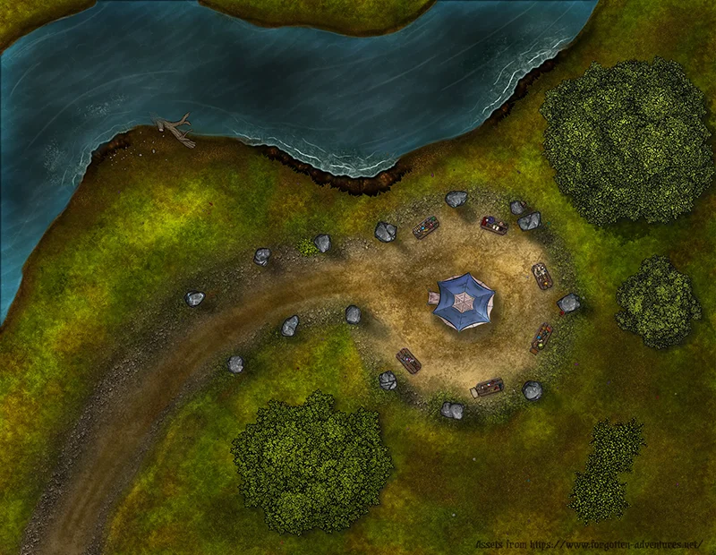

# Footsteps and Maps

With this module the GM can add an animation of a ghostly image and its foot prints as it makes its way though the dungeon.
It also contains additional assets, tokens and maps for your adventures.

There are Journals for the NPC Map handouts, the other assets you can find in the /artwork directory.

Map assets and artwork by Forgotten Adventures, https://www.forgotten-adventures.net/
Vollok token inspired by and derived from artwork by Greg Bruni, https://www.gregbrunicreations.com/

**Ghost Trail Animations**
A Dynamically controlled particle system for the GM to play an animation of a ghost's path.

To use: Add the Macro "Open Footsteps Control" from the Footsteps and Maps Macro folder.

Click on it to open the floating control window. If you havent modified the MapIDs it will auto-detect the path to play.
Use play/pause/speed control on the animation, or scrub with the timeline

**NPC Map Journals**
Journal Handouts for maps that can be provided by NPCs

Boss Skrawg – Inspired by DMSteve, https://www.recallknowledge.com/

Graulgust's sketch

Volluk's Desk - blueprints of levels 1-3

**Tokens**
- Top down tokens for these NPCs: C1-Augrael, D8-Volluk, and D9-LasdaVenkervale

Hazard tokens for the BrownMold(B20) and Hall of Hatred(B29)

**Area Map for Wrin's Wonders**

